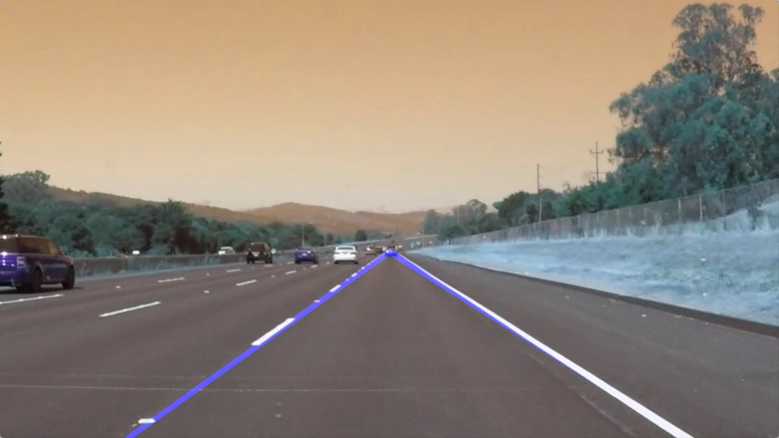

# **Finding Lane Lines on the Road**

## This is the writeup for the first project of the Self Driving Nanodegree Term1 Course: Computer Vision and Deep Learning

---

**Finding Lane Lines on the Road**

The goals / steps of this project are the following:
* Make a pipeline that finds lane lines on the road
* Reflect on your work in a written report

[//]: # (Image References)

[image1]: ./examples/grayscale.jpg "Grayscale"
[image2]: ./test_images/solidWhiteCurve.jpg "Solid White Curve"
[image3]: ./test_images/solidWhiteRight.jpg "Solid White Right"
[image4]: ./test_images/solidYellowCurve.jpg "Solid Yellow Curve"
[image5]: ./test_images/solidYellowCurve2.jpg "Solid Yellow Curve2"
[image6]: ./test_images/solidYellowLeft.jpg "solidYellowLeft"
[image7]: ./test_images/whiteCarLaneSwitch.jpg "whiteCarLaneSwitch"
[image8]: ./test_images/out/solidWhiteCurve.jpg "Solid White Curve _ Out"
[image9]: ./test_images/out/solidWhiteRight.jpg "Solid White Right _ Out"
[image10]: ./test_images/out/solidYellowCurve.jpg "Solid Yellow Curve _ Out"
[image11]: ./test_images/out/solidYellowCurve2.jpg "Solid Yellow Curve2 _ Out"
[image12]: ./test_images/out/solidYellowLeft.jpg "solidYellowLeft _ Out"
[image13]: ./test_images/out/whiteCarLaneSwitch.jpg "whiteCarLaneSwitch _ Out"

---

### Reflection

### 1. Describe your pipeline. As part of the description, explain how you modified the draw_lines() function.

My pipeline consists of 7 steps. First I import the image and convert it to grayscale. Then I apply a Gaussian smoothing filter. Then detect edges using a canny edge detector. I then create a mask for the area of interest where the highway lines are likely to reside. I perform a hough transform to detect the lines within the masked area and then output (draw) the lines on the original image.

The pipeline is tested on the given 6 test images. The test images are shown alongside the images with the lines annotated.
  

  

  

  

  

  

---

To draw an extrapolated line in place of the separate line segments, I modified the draw_lines() function to compute the slope of each line segment and separate the lines into two groups, depending on the slope sign, I then take the median of the slope values for each side, extrapolate to find the furthest bottom points using the median slope, then extrapolate again from that point to a fixed vertical height to determine and draw the final left and right lines on the image.

### 2. Identify potential shortcomings with your current pipeline

There are a number of shortcomings with this simple method.
* It would not work well in areas where lines are blurred, erased or nonexistent obviously.
* It disregards knowledge from previous frames, that would otherwise make it robust against outliers.
* A straight line is not suitable for curved roads, an interpolated curve of small line segments would result in a better fit.

### 3. Suggest possible improvements to your pipeline

A better line fit can be done using a spline interpolation method on finer line segments, this will make it robust to bends and curves on the road. The information gained from previous image frames should not be discarded, but used with a model and perhaps a Bayesian filter, which is what we will probably get to do later in the course I'm sure. The information from vehicles driving ahead could be used to estimate the parameters of the highway path too.
